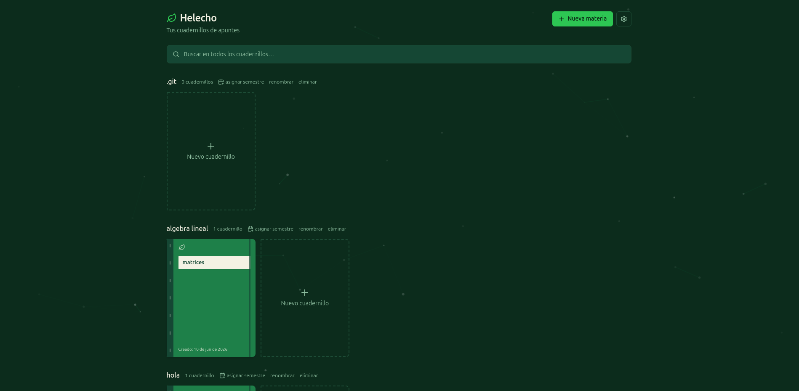

# Helecho

Editor de escritorio nativo para apuntes de estudio. Sin LaTeX, sin comandos. El usuario hace clic en un símbolo y se inserta. Se guarda como Markdown enriquecido y se exporta a PDF limpio. Incluye navegador integrado, panel de referencia y un bloque de herramientas de estudio.



---

## Descargas

**[Última release](https://github.com/luistriana032006/Helecho/releases/latest)** — Linux (amd64):

- **`.AppImage`** — portable, no requiere instalación. `chmod +x` y ejecutar. Se actualiza sola.
- **`.deb`** — para distribuciones basadas en apt (Debian, Ubuntu y derivados). Instala vía el gestor de paquetes. No se auto-actualiza: para versiones nuevas hay que bajar e instalar el `.deb` de nuevo a mano.

Instalador de Windows: aún no disponible.

---

## Características principales

- **Editor visual** — inserta símbolos matemáticos con un clic, sin escribir LaTeX
- **Cuadernillos** — organiza tus apuntes en pestañas independientes, con bóveda configurable (estilo Obsidian)
- **Multitarea en una sola página** — múltiples paneles activos simultáneamente, con columnas estilo Word
- **Exportación a PDF** — salida limpia directamente desde la app
- **Guardado en Markdown** — formato abierto, legible fuera de la app
- **Diagramas Mermaid** — flujo, secuencia y estados, editables desde el editor
- **Alexandria** — navegador web integrado (múltiples pestañas, modo enfoque, bloqueo de anuncios opcional, indicador de conexión)
- **Panel de referencia** — visor de PDF, Word y PowerPoint junto al apunte
- **Post-its flotantes** — notas ancladas sobre el apunte, con línea guía y colores
- **Tipografías y tamaño de texto** por selección, estilo Word
- **Bloque de herramientas** — temporizador Pomodoro, tarjetas de repaso (flashcards), calculadora científica, grafos de Discreta, gráficas de datos editables (Plotly) y bloques de función editables
- **Auto-actualización** — la app (AppImage) avisa y se actualiza sola cuando hay una versión nueva

## Evidencia de paneles


Los paneles funcionan de forma independiente dentro de una misma ventana, permitiendo trabajar con múltiples cuadernillos al mismo tiempo.

---

## Stack

| Capa | Tecnología |
|------|-----------|
| Shell | Electron + electron-vite |
| Frontend | React + TypeScript |
| Editor | TipTap |
| Matemáticas | KaTeX |
| Estilos | Tailwind CSS |
| Diagramas | Mermaid |
| Navegador integrado (Alexandria) | Electron `<webview>` |
| Gráficas de datos | Plotly |
| Cálculo | math.js |
| Empaquetado | electron-builder (AppImage, .deb) |
| Auto-actualización | electron-updater + GitHub Releases |

---

## Arranque en desarrollo

```bash
env -u ELECTRON_RUN_AS_NODE DISPLAY=:0 npm run dev -- --no-sandbox
```

---

## Estado del proyecto

- **V1.5** (10 jun 2026) — editor funcional con símbolos, cuadernillos y exportación PDF
- **V2** (jun–jul 2026) — Alexandria (navegador integrado), panel de referencia con Word/PPT, bloque de herramientas de estudio, empaquetado Linux
- **v1.0.0 publicada** (9 jul 2026) — primera release descargable, con todo lo de V2 incluido

---

*Helecho — Socorro, Santander 🇨🇴*
